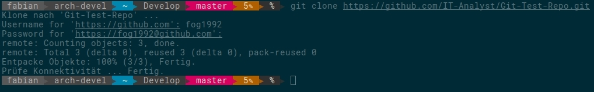

#  Git Test Repo

Mit diesem Git-Repositorie soll der Umgang mit git gelernt werden.

1. Kolnen des Repo

  `git clone https://github.com/IT-Analyst/Git-Test-Repo.git`

  

2. Eine neue Datei erzeugen

  Erstellen Sie mit einem Editor einen neue Datei. Zum Beispiel `vorname_nachname.txt`

3. Datei zu Git hinzufügen:

  `git add vorname_nachname.txt`

  Die Datei ist jetzt für den nächsten Commit vorgemerkt.

4. Commit erzeugen

  Der Befehl `git commit -v` öffnet einen Editor (default vim). Hier wird die Commit-Nachricht verfasst. Mit '-v' werden noch alle Änderungen an den Dateien im Editor angezeigt.
  
